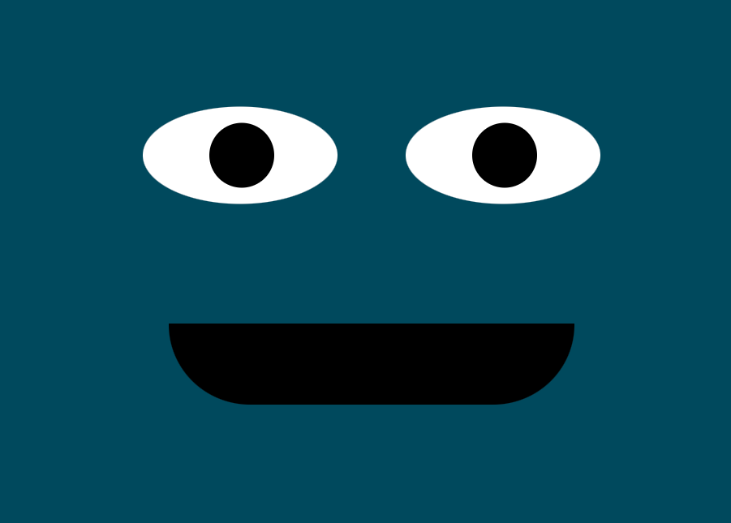

# Eyes

## Description 
This is a decent and easy representation of how one can use cascading style sheets and javascript to manipulate the display and functionality of a web page.  It also is a good representation of how a browser interacts with the movement of the mouse.
Originally, the example had one eye. A second eye was added as part of the original exercise. In doing so it reminded me of Cookie Monster from Sesame Street, so a mouth was added and a cookie for the cursor.

## Purpose 
This was done as an assignment in the MIT course - Full Stack Development with Mern

---------

## Technologies Used 
- HTML
- CSS
- Javascript

---------

## Installation 
- Clone this repository to your local machine

## How to Run 
- Browse to the directory where you cloned this repository
- Open the .html file in a browser (Chrome, Edge, Safari, Firefox)
- Move the mouse around the browser and watch the eyes follow the cookie.

---------

## Files 
- **/images/CookieMonster.png** - Used in the Readme file 
- **/images/cookie.cur** - Cursor file used to change the default cursor 
- **index.html** - Start-up file to be opened by browse 
- **styles.css** - Stylesheet file that positions objects, controls text, colors, and layout
- **eyes.js** - Javascript file manipulating what is occuring in the browser 

---------

## Improvements Made
- 2022-02-04: Added a mouth
- 2022-02-04: Changed the mouse cursor to be a cookie

## Roadmap of Future Improvements
- Add a tongue to the mouth when the cookie is over the mouth area

---------

## Contributing 
Pull requests are welcome. For major changes, please open an issue first to discuss what you would like to change.

## License
[The MIT License (MIT)](https://github.com/slumpbuster/Eye-Exercse/blob/main/LICENSE)
