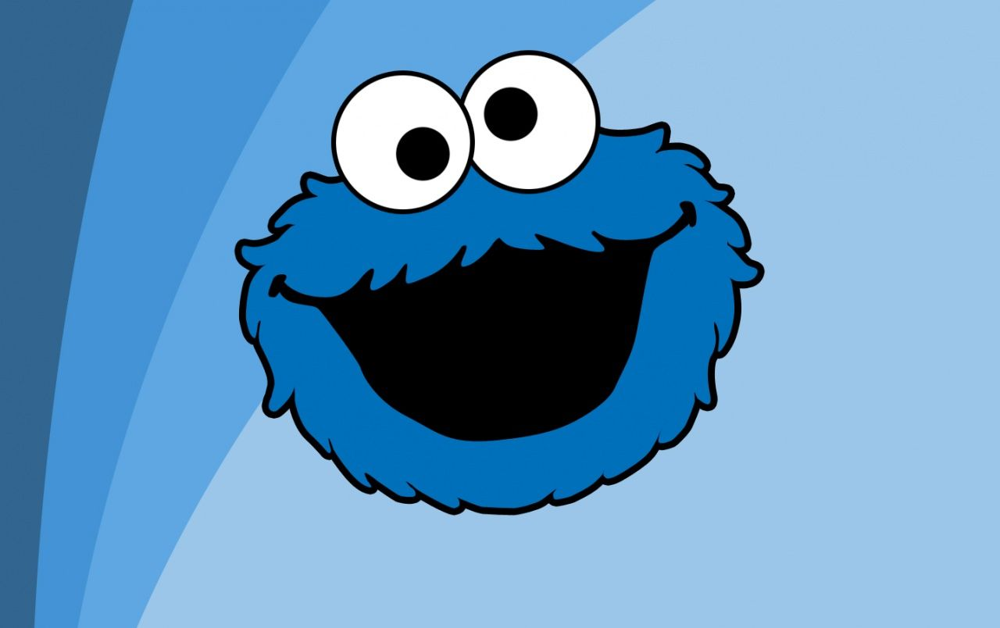

# Eyes
# 

## Description 
This is a decent and easy representation of how one can use cascading style sheets and javascript to manipulate the display and functionality of a web page.  It also is a good representation of how a browser interacts with the movement of the mouse.
Originally, the example had one eye. A second eye was added as part of the original exercise. In doing so it reminded me of Cookie Monster from Sesame Street, so a mouth was added and a cookie for the cursor.

---------

## How to Run 
- Open the .html file in a browser (Chrome, Edge, Safari, Firefox)
- Move the mouse around the browser and watch the eyes follow the cookie.

---------

## Files 
- **/images/CookieMonster.jpg** - Used in the Readme file 
- **/images/cookie.cur** - Cursor file used to change the default cursor 
- **index.html** - Start-up file to be opened by browse 
- **styles.css** - Stylesheet file that positions objects, controls text, colors, and layout
- **eyes.js** - Javascript file manipulating what is occuring in the browser 

---------

## Improvements Made
- 2022-02-04: Added a mouth
- 2022-02-04: Changed the mouse cursor to be a cookie

---------

## Roadmap of future improvements
- Add a tongue to the mouth when the cookie is over the mouth area

## Purpose 

This was done as an assignment in the MIT course - Full Stack Development with Mern

---------

The MIT License (MIT)
=====================

Copyright © 2022 slumpbuster

Permission is hereby granted, free of charge, to any person
obtaining a copy of this software and associated documentation
files (the “Software”), to deal in the Software without
restriction, including without limitation the rights to use,
copy, modify, merge, publish, distribute, sublicense, and/or sell
copies of the Software, and to permit persons to whom the
Software is furnished to do so, subject to the following
conditions:

The above copyright notice and this permission notice shall be
included in all copies or substantial portions of the Software.

THE SOFTWARE IS PROVIDED “AS IS”, WITHOUT WARRANTY OF ANY KIND,
EXPRESS OR IMPLIED, INCLUDING BUT NOT LIMITED TO THE WARRANTIES
OF MERCHANTABILITY, FITNESS FOR A PARTICULAR PURPOSE AND
NONINFRINGEMENT. IN NO EVENT SHALL THE AUTHORS OR COPYRIGHT
HOLDERS BE LIABLE FOR ANY CLAIM, DAMAGES OR OTHER LIABILITY,
WHETHER IN AN ACTION OF CONTRACT, TORT OR OTHERWISE, ARISING
FROM, OUT OF OR IN CONNECTION WITH THE SOFTWARE OR THE USE OR
OTHER DEALINGS IN THE SOFTWARE.
